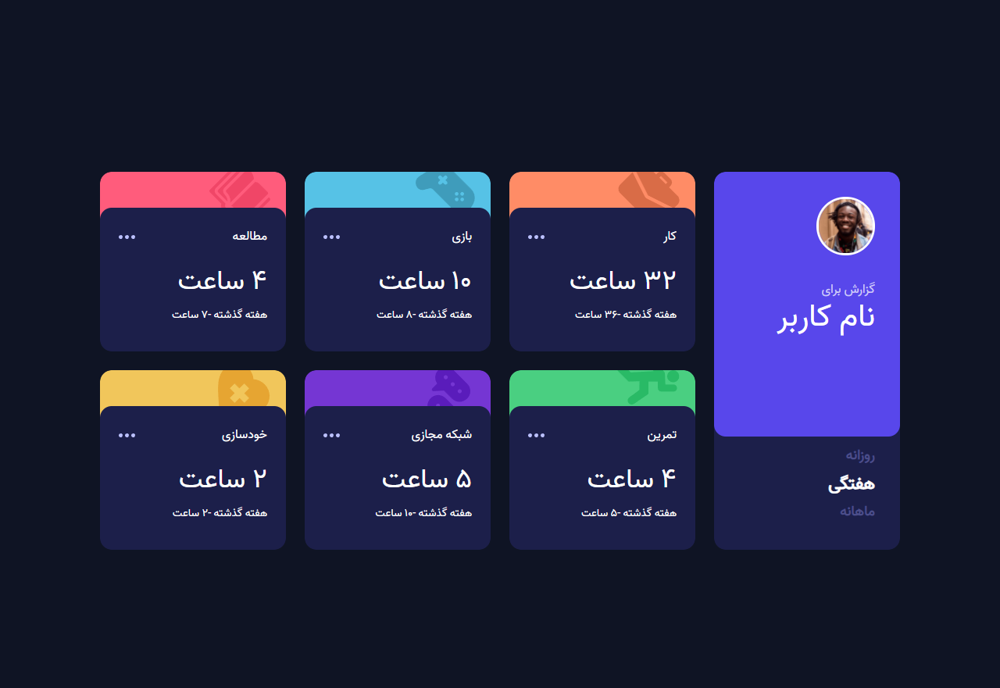

# Time tracking dashboard solution

## Table of contents

- [Overview](#overview)
  - [The challenge](#the-challenge)
  - [Screenshot](#screenshot)
  - [Links](#links)
- [My process](#my-process)
  - [Built with](#built-with)
  - [What I learned](#what-i-learned)
- [Author](#author)

## Overview

### The challenge

Users should be able to:

- View the optimal layout for the site depending on their device's screen size
- See hover states for all interactive elements on the page
- Switch between viewing Daily, Weekly, and Monthly stats

### Screenshot



### Links

- Solution URL: [Add solution URL here](https://github.com/MiladRostami01/Time-tracking-dashboard)
- Live Site URL: [Add live site URL here](https://time-tracking-dashboard-xi.vercel.app/)

## My process

### Built with

- HTML5 markup
- CSS custom properties
- Flexbox
- CSS Grid
- Desktop-first workflow
- JavaScript

### What I learned

what I learn here is a bounch of cool stuff like: 
- how to fetch Data from json file 
- how to loop on Data informations and cards
- how to show clock with hour and hours challeng 
- and the animations which is realy cool ...

```html
<div class="card work">
    <div class="bg">
      <div class="bg-title">Work</div>
      
    </div>
    <div class="card-info">
      <div class="title">
        <p>کار</p>
        <svg width="21px" height="5px" xmlns="http://www.w3.org/2000/svg">
          <path d="M2.5 0a2.5 2.5 0 1 1 0 5 2.5 2.5 0 0 1 0-5Zm8 0a2.5 2.5 0 1 1 0 5 2.5 2.5 0 0 1 0-5Zm8 0a2.5 2.5 0 1 1 0 5 2.5 2.5 0 0 1 0-5Z"
            fill="#BBC0FF" fill-rule="evenodd"/>  
        </svg>
      </div>
      <div class="content Work">
        <h1 class="current"></h1>
        <p class="previous ">لطفا منتظر بمانید...</p>
      </div>
    </div>
  </div>
```
```css
.animation{
  animation-name: cardChange;
  animation-duration: 2s;
  animation-timing-function: ease;
}
@keyframes cardChange{
  0% {transform: scale(1) translatey(0em); }
  10% {transform: scale(1.04) translatey(0em);}
  25% {transform: scale(1.04) translatey(2.4em);}
  40% {transform: scale(0.95) translatey(2.4em); z-index: -1;}
  50%, 55% {transform: scale(0.95) translatey(-1em) scaleY(0); transform-origin: top;
    z-index: -1;}
  65% {transform: scale(0.95) translatey(2.4em) scaleY(1); transform-origin: top;
   z-index: -1; }
  75% {transform: scale(1.04) translatey(2.4em) scaleY(1);
    z-index: 2;}
  90% {transform: scale(1.04) translatey(0em) scaleY(1); z-index: 2;}
  100% {transform: scale(1) translatey(0em) scaleY(1); z-index: 2; }
}
```
```js
// For English mode
const clockHandler = (clock) => clock == 1 || clock == 0 ? 'hr' : 'hrs'
```

## Author

- Website - [Miladrostami01.ir](https://miladrostami01.ir/)
- Instagram- [milad_rostami_01](https://www.instagram.com/milad_rostami_01/)
- linkedin - [Milad Rostami](https://www.linkedin.com/in/miladrostami01/)

## Frontend mentor 
  This is a solution to the [Time tracking dashboard challenge on Frontend Mentor](https://www.frontendmentor.io/challenges/time-tracking-dashboard-UIQ7167Jw). Frontend Mentor challenges help you improve your coding skills by building realistic projects. 